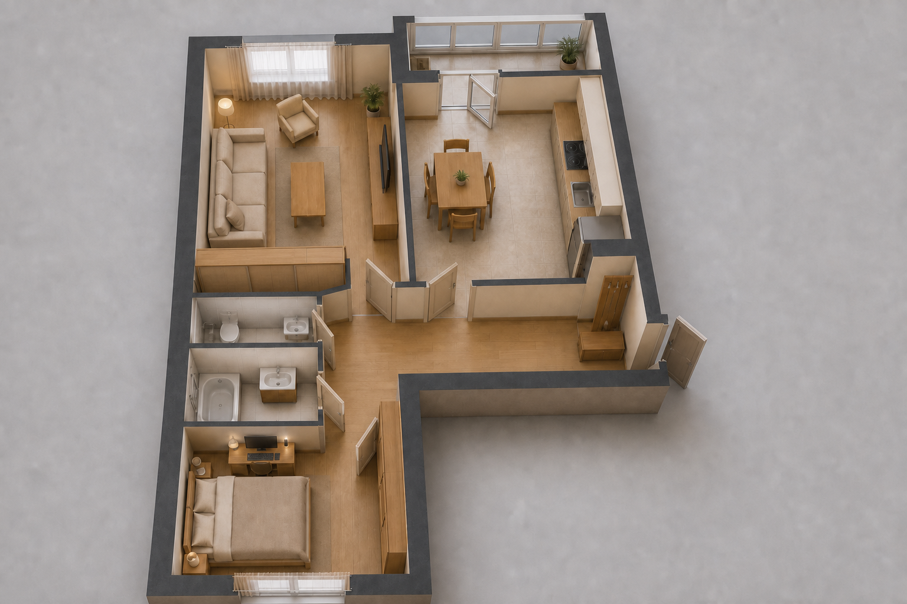
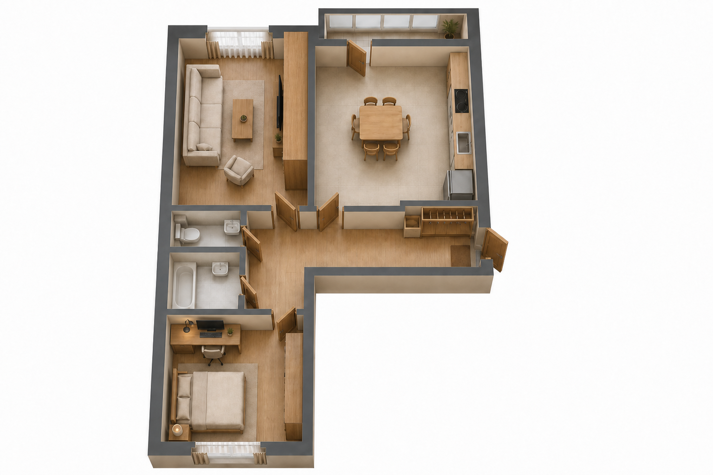
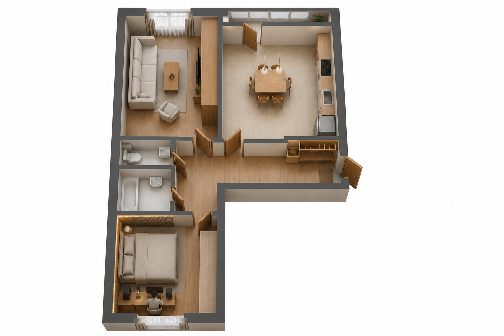
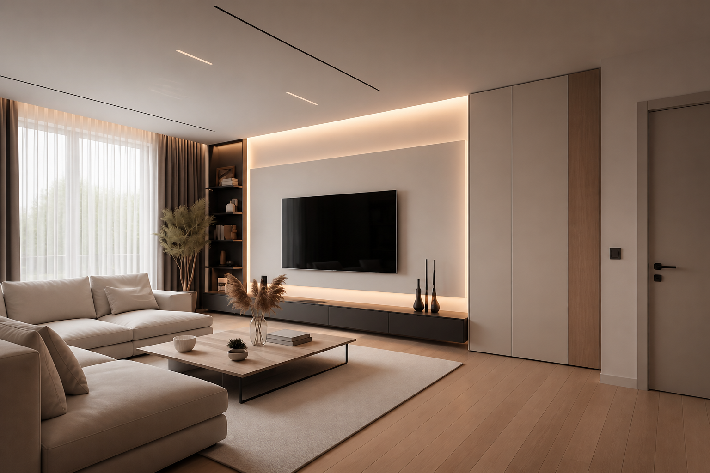
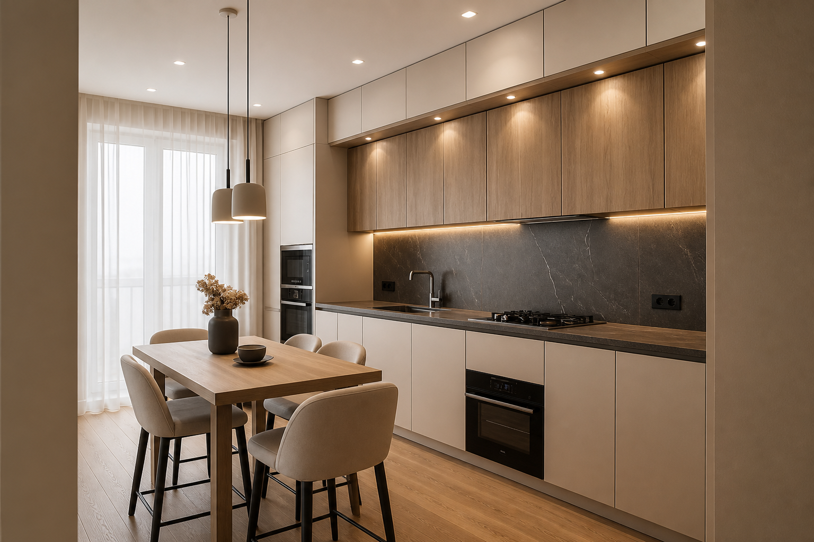
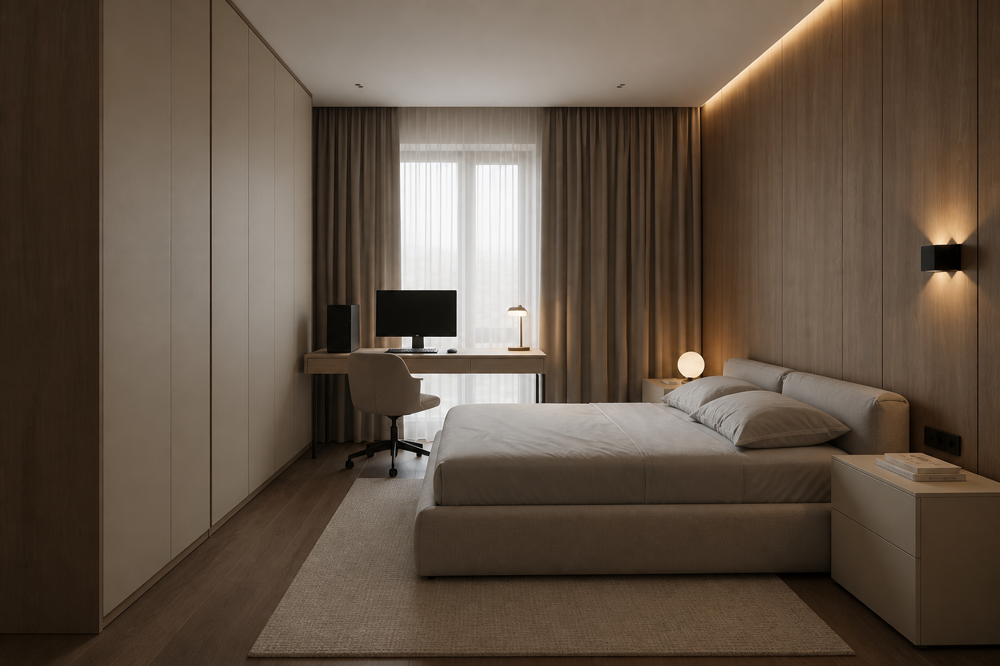
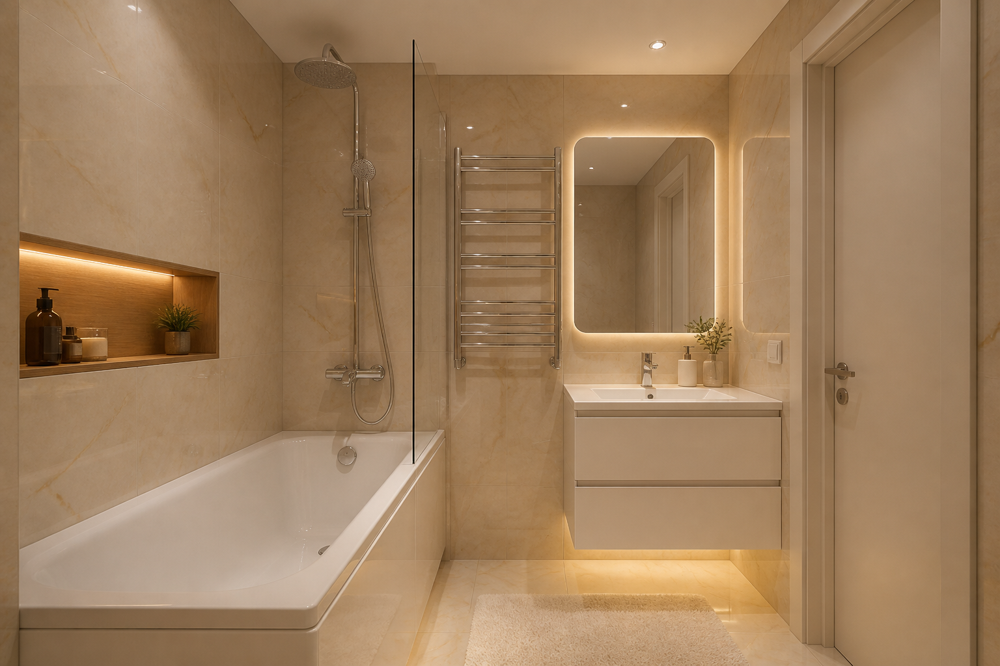
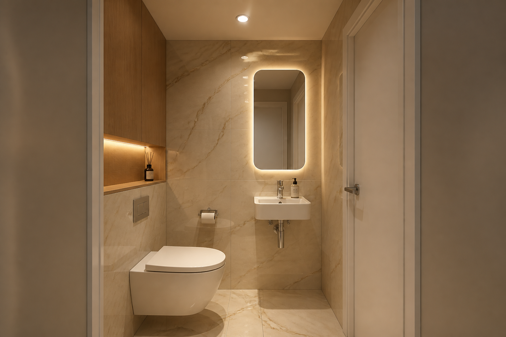
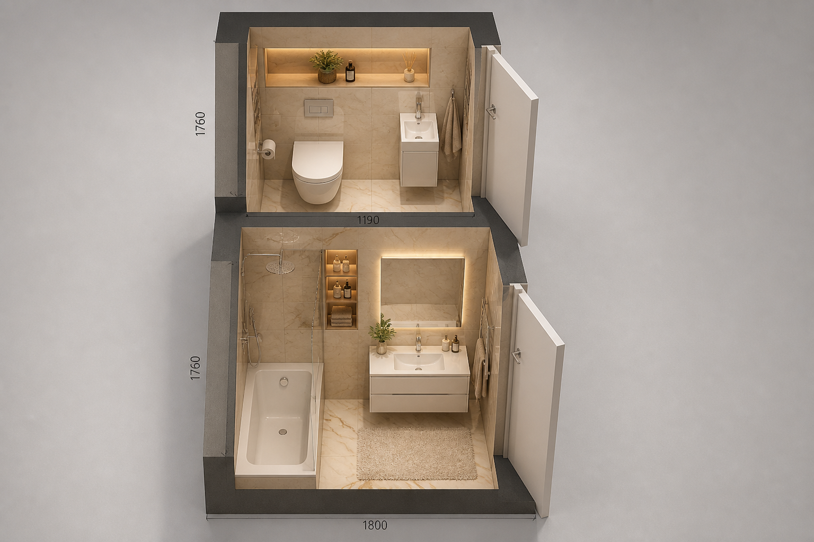

# Дизайн и смета квартиры, Казань

Двушка **56,12 м²**, тёплый минимализм. Старт — предчистовая (стяжка, штукатурка, окна, входная дверь уже есть). В цифры ремонта не входят гарнитур, шкафы, мягкая мебель и техника.

Пол: линолеум в гостиной, спальне, прихожей и на кухне. Плитка только в ванной и туалете.

## Смета

Один вариант: визуал с картинок, без лишнего бренда и скрытых дверей.

**≈ 1,84 млн ₽** с запасом 8% (1,71 млн без запаса).

- Полная смета: [SMETA.md](SMETA.md)
- Та же таблица для Excel: [smeta.csv](smeta.csv)

## Визуализации

