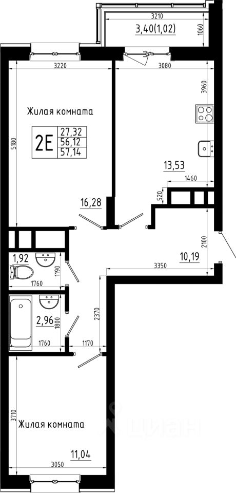
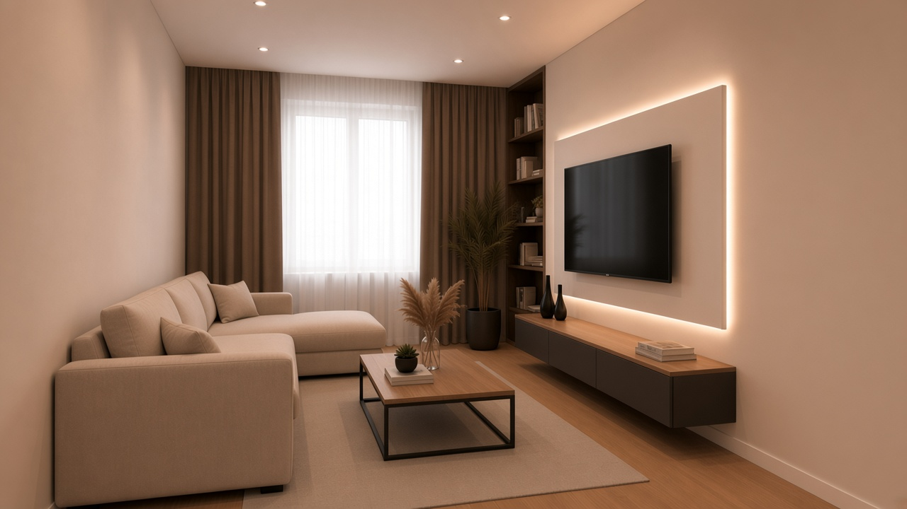
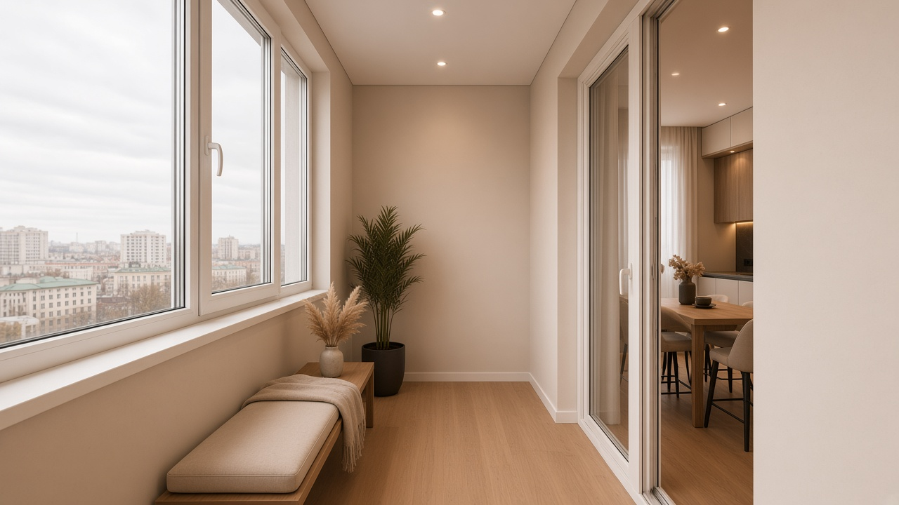

# Дизайн и смета квартиры, Казань

Двушка **56,12 м²**, тёплый минимализм. Старт — предчистовая (стяжка, штукатурка, окна, входная дверь уже есть). В цифры ремонта не входят гарнитур, шкафы, мягкая мебель и техника.

Пол: линолеум в гостиной, кухне, спальне, прихожей и лоджии. Плитка только в ванной и туалете. Прихожей нет в фото комнат — в смете она заложена с плана (10,19 м²). Лоджия 3,40 м² — по фото: тот же дуб, крем, споты, раздвижная дверь, скамья. В спальне кровать уже есть: [Пальмира](https://architektoria.ru/krovati/palmira/), 160×200.

## Смета

Один вариант: визуал с картинок комнат, без лишнего бренда и скрытых дверей.

**≈ 2,03 млн ₽** с запасом 8% (1,88 млн без запаса).

- Полная смета: [SMETA.md](SMETA.md)
- Та же таблица для Excel: [smeta.csv](smeta.csv)

## Визуализации

